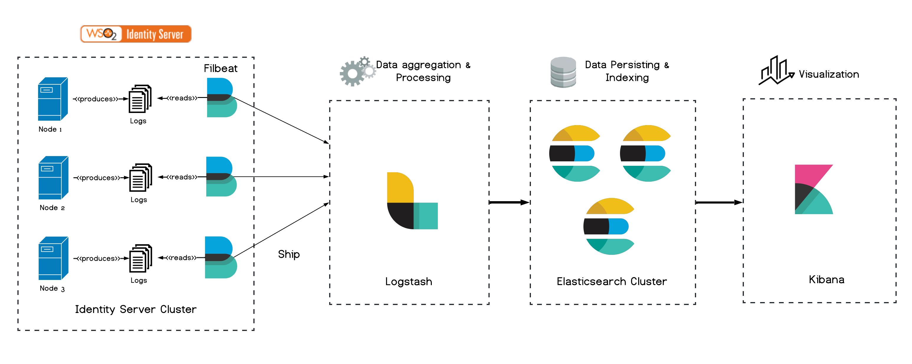
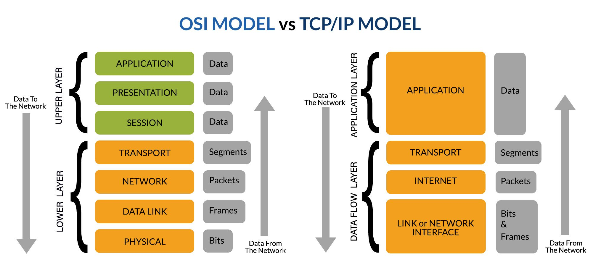

# 🛡️ BlueTeam-Handbook  
### The Ultimate SOC1/2 Interview & Knowledge Guide  

Welcome to **BlueTeam-Handbook**, your one-stop resource for mastering **SOC1/2 interview questions** and sharpening your **Blue Team defensive security skills**.  
This handbook covers everything from **SIEMs** to **Incident Response**, with categorized questions, explanations, and real-world scenarios.  

---

## 📑 Table of Contents  

- [SOC Fundamentals](#-soc-fundamentals)  
- [SIEM](#-siem-security-information-and-event-management)  
- [Network Security](#-network-security)  
- [Endpoint Security](#-endpoint-security)  
- [Threat Intelligence & Hunting](#-threat-intelligence--hunting)  
- [Malware Analysis](#-malware-analysis-basic-for-soc)  
- [Incident Response](#-incident-response)  
- [Vulnerabilities & Exploits](#-vulnerabilities--exploits)  
- [Security Tools](#-security-tools)  
- [Case Study Questions](#-case-study-questions)  
- [Behavioral & Scenario Questions](#-behavioral--scenario-questions)  

---

## 🏢 SOC Fundamentals  

SOC Fundamentals focus on the core roles, processes, and tools used in a Security Operations Center. Analysts monitor, detect, and respond to security incidents while understanding the SOC structure, tiers, and best practices.

### ❓ What is a SOC and why do organizations need it?  
A **Security Operations Center (SOC)** is a centralized unit that **monitors, detects, analyzes, and responds** to cybersecurity incidents.  
Organizations need a SOC to:  
- Provide **24/7 monitoring** of systems and networks.  
- Detect **anomalies, intrusions, and threats** in real-time.  
- Support **incident response** and reduce business impact.  
- Ensure compliance with **regulatory frameworks** (ISO 27001, PCI-DSS, HIPAA, etc.).

### ❓ Explain SOC roles & tiers (L1, L2, L3, Threat Hunter, IR).  

- **Tier 1 (SOC Analyst / Alert Triage):**  
  - Monitors SIEM alerts.  
  - Performs **initial triage**.  
  - Escalates real incidents to Tier 2.  

- **Tier 2 (Incident Responder):**  
  - Performs **deep analysis** of alerts.  
  - Investigates **log correlations, network traffic, malware samples**.  
  - Coordinates containment & remediation.  

- **Tier 3 (Threat Hunter / SME):**  
  - Hunts for **unknown/advanced threats** using hypothesis-driven searches.  
  - Creates **detection rules & playbooks**.  
  - Supports Tier 1 & 2.  

- **Incident Response Team (IR):**  
  - Specialized responders handling **containment, eradication, recovery**.  
  - Works closely with legal, PR, and management.  

### ❓ What is the difference between detection and prevention?  

- **Detection:**  
  - Identifying suspicious or malicious activity **after it occurs**.  
  - Example: SIEM alert for failed login attempts.  

- **Prevention:**  
  - Blocking malicious activity **before it causes harm**.  
  - Example: Firewall blocking malicious IP addresses.  

👉 A mature SOC uses **both detection and prevention** to strengthen defense.  

### ❓ What types of data/logs does a SOC collect?  
- **Network logs:** Firewall, IDS/IPS, proxies, routers.  
- **Endpoint logs:** Antivirus, EDR, Windows Event IDs, Sysmon.  
- **Authentication logs:** Active Directory, LDAP, IAM systems.  
- **Application logs:** Web servers, databases.  
- **Cloud logs:** AWS CloudTrail, Azure Monitor, GCP Logs.

📸 *[Common Log Data types]*  


### ❓ What is the Cyber Kill Chain model?  
The **Cyber Kill Chain** by `Lockheed Martin` describes attacker steps:  
1. Reconnaissance  
2. Weaponization  
3. Delivery  
4. Exploitation  
5. Installation  
6. Command & Control  
7. Actions on Objectives

👉 SOC teams map detections and defenses to each phase.

📸 *[Cyber Kill Chain model]*  


### ❓ What is the MITRE ATT&CK framework and why is it important for SOC?  
- **MITRE ATT&CK** is a knowledge base of **tactics, techniques, and procedures (TTPs)** used by adversaries.  
- Helps SOC teams to:  
  - Map alerts to known attacker behaviors.  
  - Develop detection use cases.  
  - Guide threat hunting.  
  - Identify coverage gaps.


### ❓ What are common SOC challenges?  
- **Alert fatigue:** Too many false positives.  
- **Tool overload:** Managing multiple tools without integration.  
- **Skill gap:** Shortage of trained SOC analysts.  
- **Evolving threats:** Adapting to zero-days and new attack techniques.  
- **Visibility gaps:** Missing logs or blind spots in monitoring.  

---

## 📊 SIEM (Security Information and Event Management)  

SIEM focuses on collecting, analyzing, and correlating security logs from multiple sources. SOC analysts use SIEM tools to detect, investigate, and respond to threats, enabling centralized monitoring and alerting across the organization.

### ❓ What is a SIEM and how does it work?  
A **SIEM** collects, correlates, and analyzes security events from multiple sources in real-time.  
It helps SOC teams **detect, investigate, and respond** to threats efficiently.  
- **Data sources:** Logs from firewalls, endpoints, servers, applications, and cloud services.  
- **Functions:** Aggregation, normalization, correlation, alerting, reporting.  

### ❓ Name 3 popular SIEM tools and their advantages.  
- **Splunk:** Powerful search, dashboarding, and app ecosystem.  
- **QRadar:** Advanced correlation engine and threat intelligence integration.  
- **Wazuh / ELK:** Open-source, customizable, great for learning and labs.


### ❓ What’s the difference between a correlation rule and a detection use case?  
- **Correlation Rule:** Combines multiple events to generate an alert.  
  - Example: 5 failed logins + 1 successful login = alert.  
- **Detection Use Case:** Broader scenario the SOC wants to detect, often implemented via rules, dashboards, or playbooks.  

### ❓ What is log normalization in SIEM?  
Log normalization is the process of **standardizing log data** from different sources so the SIEM can **correlate and analyze** it effectively.  

### ❓ What is the difference between real-time and historical analysis in SIEM?  
- **Real-time:** Detects threats as they occur using live data streams.  
- **Historical:** Investigates past incidents or trends using stored logs.  

### ❓ What is a SIEM dashboard?  
A **dashboard** visualizes key metrics, alerts, and trends for SOC analysts.  

📸 *[Example Wazuh SIEM dashboard]*  


### ❓ What is the difference between on-premises and cloud SIEM?  
- **On-premises:** Installed in local infrastructure; full control, higher maintenance.  
- **Cloud SIEM:** Hosted in the cloud; scalable, easier deployment, often subscription-based.  

### ❓ Describe a typical SIEM architecture.  
- **Data Sources:** Endpoints, network devices, applications, cloud logs.  
- **Log Collection Layer:** Agents or syslog servers collect and forward data.  
- **Parsing & Normalization Layer:** Converts raw logs into structured events.  
- **Correlation & Analysis Layer:** Applies rules, detection logic, and machine learning.  
- **Storage Layer:** Retains historical logs for investigation and compliance.  
- **Presentation Layer:** Dashboards, alerts, reports for SOC analysts.  

📸 *[Example ELK SIEM architecture]*  


### ❓ What is the workflow of a SIEM in a SOC?  
1. **Log Collection:** Gather logs from multiple sources.  
2. **Normalization:** Convert logs to a standard format.  
3. **Correlation & Detection:** Identify patterns, anomalies, or threats.  
4. **Alerting:** Generate alerts for suspicious events.  
5. **Investigation:** SOC analysts review alerts, perform triage, escalate if needed.  
6. **Response:** Containment, mitigation, and remediation of incidents.  
7. **Reporting:** Metrics, KPIs, compliance reports.

📸 *[SIEM workflow]*  


### ❓ What are the key challenges in SIEM deployment?  
- Handling **large volumes of logs** without performance loss.  
- **False positives** from poorly tuned rules.  
- Integrating **diverse data sources** from different vendors.  
- Maintaining **retention policies** for compliance.  
- **Skill gaps**: SOC staff need SIEM expertise.  

### ❓ What is the difference between agent-based and agentless log collection?  
- **Agent-based:** Software installed on endpoints to forward logs securely and reliably.  
- **Agentless:** Collects logs remotely (e.g., via syslog, API) without installing software on endpoints.

### ❓ How does a SIEM support threat hunting?  
- Provides **historical data and correlations** for hunting.  
- Allows analysts to **query logs** across multiple sources.  
- Integrates **MITRE ATT&CK and threat intelligence feeds**.  
- Helps identify **unknown/advanced threats** proactively.  

### ❓ How does a SIEM integrate with SOAR?  
- SIEM generates alerts.  
- SOAR automates **playbooks** to investigate, contain, and remediate incidents.  
- Reduces **manual effort** and improves **response speed**.

---

## 🌐 Network Security  

Network Security focuses on protecting the organization’s network infrastructure, monitoring traffic, and detecting malicious activity. SOC analysts analyze logs, IDS/IPS alerts, and network flows to identify and respond to threats in real time.

### ❓ Explain the difference between the OSI and TCP/IP models.  
- **OSI (7 layers):** Application, Presentation, Session, Transport, Network, Data Link, Physical.  
- **TCP/IP (4 layers):** Application, Transport, Internet, Network Access.  
- OSI is theoretical; TCP/IP is practical and used in real networking.  

📸 *[OSI vs TCP/IP]*  


### ❓ How would you detect a DDoS attack?  
- **Indicators:** Unusual traffic spikes, service unavailability, abnormal bandwidth usage.  
- **Detection tools:** NetFlow, IDS/IPS, SIEM alerts, firewall logs.  
- **SOC action:** Identify attack type (volumetric, application-layer, protocol), mitigate via rate-limiting, WAF, scrubbing.  

### ❓ IDS vs IPS – key differences.  
- **IDS (Intrusion Detection System):** Monitors and alerts on suspicious traffic, but does not block.  
- **IPS (Intrusion Prevention System):** Detects and blocks malicious traffic in real-time.  

### ❓ What are common types of network attacks?  
- DDoS / DoS  
- Man-in-the-Middle (MITM)  
- ARP Spoofing  
- DNS Poisoning  
- Port Scanning & Reconnaissance  

### ❓ What is a firewall and what are its types?  
- **Firewall:** A security device that monitors and controls traffic based on rules.  
- **Types:**  
  - Packet Filtering Firewall  
  - Stateful Inspection Firewall  
  - Application Firewall (WAF)  
  - Next-Gen Firewall (NGFW)  

### ❓ Explain the difference between symmetric and asymmetric encryption.  
- **Symmetric:** Same key for encryption/decryption (AES, DES). Fast but key distribution is hard.  
- **Asymmetric:** Public/private key pair (RSA, ECC). Secure key exchange, but slower.  

### ❓ What is a VPN and how does it secure communication?  
- **VPN (Virtual Private Network):** Encrypts traffic between user and network over public internet.  
- Uses tunneling protocols (IPSec, SSL/TLS).  
- Ensures **confidentiality, integrity, and authentication**.  

📸 *[VPN tunnel diagram]*  


### ❓ Explain Zero Trust Network Security.  
- "Never trust, always verify."  
- Every request is authenticated, authorized, and encrypted.  
- Reduces lateral movement risks.  

📸 *[Zero Trust Security]*  


### ❓ What is network segmentation and why is it important?  
- Dividing a network into smaller zones with limited communication.  
- Prevents lateral movement, improves performance, enforces least privilege.  
- Example: Separating user VLANs from critical servers.  

### ❓ How does DNS monitoring help in SOC operations?  
- Detects suspicious domains (C2 servers, phishing).  
- Monitors unusual DNS queries (fast-flux, tunneling).  
- Can trigger alerts in SIEM.  

### ❓ What is SSL/TLS inspection and why is it used?  
- Decrypts encrypted traffic at the firewall/proxy for inspection.  
- Detects malware hidden in HTTPS.  
- Balance between **security and privacy**.  

### ❓ How would you investigate a suspicious IP connection?  
1. Identify source/destination IP from logs.  
2. Check against threat intelligence feeds.  
3. Look for unusual ports or protocols.  
4. Correlate with other alerts (endpoint logs, firewall).  
5. Escalate if confirmed malicious.  

---

## 💻 Endpoint Security  

Endpoint Security focuses on monitoring and protecting individual devices (workstations, servers, laptops) from malicious activity. SOC analysts use logs, EDR, and behavior analysis to detect, investigate, and respond to threats on endpoints.

### ❓ What is the difference between Antivirus (AV) and Endpoint Detection & Response (EDR)?  
- **Antivirus (AV):** Signature-based detection of known malware. Limited against advanced threats.  
- **EDR:** Provides real-time monitoring, detection, and response capabilities for suspicious activities on endpoints. Includes behavior analysis, process monitoring, and forensic data.  

### ❓ How would you investigate a suspicious process on an endpoint?  
1. Identify the process (PID, parent process).  
2. Check file location & digital signature.  
3. Correlate with Sysmon logs (event 1 – process creation).  
4. Search hash in VirusTotal/Threat Intel.  
5. Review network connections (Sysmon event 3).  
6. Escalate or terminate process if malicious.  

### ❓ What is Sysmon and how is it used in SOC?  
- **Sysmon (System Monitor):** Windows tool that logs detailed system activity.  
- Captures process creation, network connections, file modifications, registry changes.  
- Provides visibility for **threat hunting** and **incident investigations**.  

### ❓ How would you investigate a potential ransomware infection on an endpoint?  
1. Identify suspicious process activity (mass file changes).  
2. Look for unusual **file extensions**.  
3. Detect network connections to C2.  
4. Isolate endpoint immediately.  
5. Check logs for initial infection vector (phishing, exploit).  

### ❓ How do you monitor Linux endpoints in SOC?  
- Use auditd, Sysmon for Linux, OSSEC/Wazuh agents.  
- Monitor `/var/log/auth.log` for login activity.  
- Watch for suspicious processes, privilege escalations, and cron jobs.  

### ❓ What are Indicators of Compromise (IoCs) on endpoints?  
- Suspicious processes (explorer.exe spawning cmd.exe).  
- Abnormal network connections.  
- Malicious file hashes.  
- Unexpected registry changes.  
- Disabled security tools.  


---

## 🔎 Threat Intelligence & Hunting  

Threat Intelligence & Hunting helps SOC analysts proactively search for malicious activity and understand the tactics, techniques, and procedures (TTPs) of adversaries.  

### ❓ What is Threat Intelligence, and why is it important in SOC operations?  
Threat Intelligence provides context about attackers, their methods, and indicators, enabling better detection, response, and prevention.  

### ❓ What is the difference between Threat Intelligence, Threat Hunting, and Threat Detection?  
 
- **Threat Intelligence** → Knowledge about adversaries and their TTPs.  
- **Threat Detection** → Identifying malicious activities using alerts, SIEMs, and EDR.  
- **Threat Hunting** → Proactively searching for hidden threats that bypass automated detection.  

### ❓ What is an IoC vs IoA?  

- **IoC (Indicator of Compromise)** → Evidence of a breach (IP, hash, domain).  
- **IoA (Indicator of Attack)** → Evidence of malicious intent or behavior (abnormal PowerShell execution, privilege escalation).  

### ❓ Explain the MITRE ATT&CK framework.  
ATT&CK is a knowledge base of adversary tactics and techniques mapped to real-world attack behaviors. Analysts use it to understand threats and align detection strategies.  

### ❓ What are the different types of Threat Intelligence?  

- **Strategic** → High-level, business impact.  
- **Tactical** → Adversary TTPs.  
- **Operational** → Threat actor campaigns and ongoing attacks.  
- **Technical** → IoCs (IP, domains, hashes).  

### ❓ What sources can provide Threat Intelligence feeds?  
Open-source (OSINT), commercial threat intel providers, ISACs, government advisories, internal telemetry.  

### ❓ What is a hunting hypothesis, and why is it important?  
A hypothesis is an assumption (e.g., "Adversary might use credential dumping") that guides the hunting process, ensuring it’s structured and measurable.  

### ❓ Give an example of a hunting query.  
Example in Splunk:  
```spl
index=windows EventCode=4688 
| where like(CommandLine, "%powershell%") 
AND like(CommandLine, "%-enc%")
```

---

## 🐛 Malware Analysis (Basic for SOC)  

Malware analysis helps SOC analysts understand, detect, and respond to malicious software infections. In a SOC1/2 context, the focus is usually on **basic identification, triage, and escalation** rather than reverse engineering.  

## 📌 Key Interview Questions  

### ❓ What are common types of malware?  
Virus, Worm, Trojan, Ransomware, Spyware, Rootkit, Adware, Keylogger.  

### ❓ What is the difference between Static and Dynamic Malware Analysis?   
- **Static Analysis** → Examining the file without executing it (hashing, strings, file headers, AV scans).  
- **Dynamic Analysis** → Running the file in a sandbox or controlled environment to observe behavior.  

### ❓ How would you analyze a suspicious file hash?  
Use online services (VirusTotal, Hybrid Analysis, Intezer) or internal sandboxes to check reputation and behavior.  

### ❓ What is the role of a sandbox in malware analysis?  
Provides a safe environment to execute malware and observe its behavior (network connections, file changes, registry modifications).  

### ❓ What is the difference between a hash (MD5/SHA256) and a YARA rule?   
- **Hash** → Identifies a specific file (but easy to bypass with changes).  
- **YARA rule** → Identifies malware families or patterns of malicious behavior across multiple variants.  

### ❓ What Windows Event IDs are useful for detecting malware execution?  
Common ones include:  
- **4688** → Process creation  
- **4624/4625** → Logon success/failure  
- **7045** → New service installed  
- **4720** → New user account created  

### ❓ How do attackers use persistence techniques?  
Examples: Run keys in registry, scheduled tasks, startup folders, malicious services, DLL hijacking.  

### ❓ What is fileless malware and how is it detected?  
Malware that operates in memory without leaving files on disk. Detected via EDR tools, PowerShell logging, Sysmon, and behavior analysis.  

### ❓ What steps would you take if an employee reports a suspicious email attachment?  
Isolate the file, collect metadata (hash, extension), analyze in sandbox, check if similar IoCs exist in TI feeds, escalate if confirmed malicious.  

### ❓ What is the role of Indicators of Compromise (IoCs) in malware analysis?  
IoCs like hashes, IPs, domains, mutexes are extracted during analysis and used for detection in SIEM/EDR.  

---

## 🚨 Incident Response  

Incident Response (IR) is the process of identifying, containing, mitigating, and recovering from security incidents. SOC analysts must understand the IR lifecycle and best practices.  

### ❓ What are the 6 phases of the Incident Response lifecycle?  
1. **Preparation** → Policies, playbooks, tools, training.  
2. **Identification** → Detect and validate incidents using SIEM, IDS/EDR.  
3. **Containment** → Short-term (isolate host) and long-term (patch vulnerabilities).  
4. **Eradication** → Remove malware, close attack vectors.  
5. **Recovery** → Restore systems and services safely.  
6. **Lessons Learned** → Post-incident report, improve defenses.  

### ❓ How do you classify incident severity?  
Factors include:  
- Number of affected systems  
- Type of attack (malware, ransomware, data exfiltration)  
- Business impact  
- Compliance or legal implications  
- **Severity levels:** Low, Medium, High, Critical  

### ❓ What would you do in case of ransomware detection?  
1. Isolate infected endpoints immediately.  
2. Identify ransomware variant (hash, process, network connections).  
3. Block C2 communication.  
4. Notify IR and management teams.  
5. Begin recovery from backups after verification.  

### ❓ What is the difference between containment and eradication?  
- **Containment:** Limit the impact of the incident (network isolation, blocking accounts).  
- **Eradication:** Remove the root cause of the incident (malware removal, patching vulnerabilities).  

### ❓ How do you preserve evidence during an incident?  
- Capture volatile data (RAM, processes, network connections).  
- Collect relevant logs from endpoints and network devices.  
- Avoid altering original evidence.  
- Document actions in chain-of-custody logs.  

### ❓ What tools are commonly used in SOC for Incident Response?  
- SIEMs: Splunk, ELK, QRadar, Wazuh  
- EDR: CrowdStrike, SentinelOne, Carbon Black  
- Network: Wireshark, Zeek, tcpdump  
- Forensics: FTK, Autopsy, Volatility  

### ❓ How do you handle a phishing incident?  
1. Isolate affected account.  
2. Analyze email headers and attachments.  
3. Search SIEM for similar indicators.  
4. Reset credentials and enforce MFA.  
5. Educate users and update phishing rules.  

### ❓ What metrics are used to measure Incident Response effectiveness?  
- **MTTD (Mean Time to Detect)**  
- **MTTR (Mean Time to Respond/Recover)**  
- Number of incidents resolved within SLA  
- Repeat incident rate  

### ❓ What is a playbook and how is it used in Incident Response?  
A playbook defines step-by-step actions for common incidents (malware, phishing, DDoS), ensuring consistency and speed in response.  

### ❓ How do you coordinate with other teams during an incident?  
- Notify IT, network, and management teams.  
- Share relevant logs and analysis.  
- Collaborate on containment, eradication, and recovery.  
- Maintain clear communication and documentation.  

---

## 🕳️ Vulnerabilities & Exploits  

Vulnerabilities & Exploits focus on identifying weaknesses in systems and understanding how attackers may exploit them. SOC analysts use scanning, threat intelligence, and patching strategies to reduce risk.  

### ❓ What is CVE & CVSS?  
- **CVE (Common Vulnerabilities and Exposures):** Public database of known vulnerabilities.  
- **CVSS (Common Vulnerability Scoring System):** Provides a severity score to prioritize remediation.  

### ❓ What is the difference between vulnerability scanning and penetration testing?  
- **Vulnerability scanning:** Automated tool to detect known weaknesses.  
- **Penetration testing:** Manual or automated simulation of attacks to exploit vulnerabilities.  

### ❓ How do you handle zero-days?  
Implement network segmentation, monitoring, and anomaly detection. Apply virtual patching and monitor threat intelligence feeds until an official patch is available.  

### ❓ What is a misconfiguration vulnerability?  
Security gaps caused by incorrect system, network, or cloud settings, e.g., open S3 buckets, weak ACLs, default credentials.  

### ❓ How do you prioritize vulnerabilities in a SOC?  
Based on **CVSS score, exploit availability, business impact, and asset criticality**. Focus first on high-risk vulnerabilities affecting critical systems.


---

## 🛠️ Security Tools  

Security tools are essential for SOC analysts to detect, investigate, and respond to threats effectively. Common tools cover SIEM, SOAR, IDS/IPS, and threat intelligence feeds.  

## 📌 Key Interview Questions  

### ❓ Name some popular SIEM tools and their advantages.  
Splunk, QRadar, ELK, Wazuh; each offers centralized logging, correlation rules, and alerting capabilities.  

### ❓ What is a SOAR platform and how does it help SOC operations?  
SOAR automates response workflows, integrates threat intelligence, and reduces manual alert handling (examples: Shuffle, Cortex XSOAR).  

### ❓ How do IDS and IPS differ, and why are they important?  
IDS detects suspicious network activity; IPS can block it. Tools like Snort and Suricata help prevent attacks.  

### ❓ What are threat intelligence feeds, and how are they used in SOC?  
Feeds like MISP and OTX provide IoCs and TTPs to enrich SIEM alerts and support proactive hunting.  

### ❓ How do you integrate multiple security tools effectively?  
By connecting SIEM, SOAR, IDS/IPS, and threat feeds to provide correlation, automated response, and centralized monitoring.  

---

## 📚 Case Study Questions  

Case study questions test practical SOC skills in analyzing incidents and applying knowledge to real-world scenarios.  

### ❓ How would you investigate a brute-force attack?  
Analyze logs from SIEM/EDR, identify the source IP, check affected accounts, and implement containment measures (block IP, reset passwords).  

### ❓ How would you analyze phishing email headers?  
Inspect the “From” address, DKIM/SPF/DMARC records, URLs, and attachments to identify malicious intent.  

### ❓ What steps would you take during lateral movement detection?  
Monitor internal network traffic, look for unusual authentication events, review SIEM alerts, and isolate affected systems.  

### ❓ How would you respond to a detected malware outbreak?  
Isolate infected endpoints, collect IoCs, run sandbox analysis, notify IR team, and initiate recovery procedures.  

### ❓ How would you handle a cloud misconfiguration incident?  
Identify misconfigured resources, restrict access, check for exfiltrated data, implement remediation, and monitor for recurring issues. 

---

## 👥 Behavioral & Scenario Questions  

Behavioral questions evaluate soft skills, prioritization, and problem-solving abilities in real SOC scenarios.  

### ❓ How do you prioritize multiple alerts?  
Assess severity, business impact, and affected assets. Focus first on critical incidents with high risk.  

### ❓ Tell me about a time you solved a difficult incident.  
Describe the situation, actions you took to investigate and resolve it, and the lessons learned.  

### ❓ How do you keep yourself updated with the latest threats?  
Follow threat intelligence feeds, security blogs, vendor advisories, social media (e.g., Twitter, LinkedIn), and participate in training.  

### ❓ How do you handle pressure during a critical security incident?  
Stay calm, follow the playbook, communicate clearly with the team, and document all actions.  

### ❓ How do you communicate findings to non-technical stakeholders?  
Use clear language, focus on impact, provide recommendations, and avoid technical jargon.  

